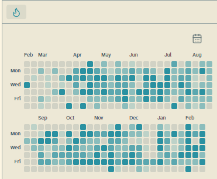
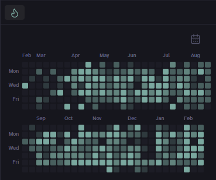

# Yet Another Obsidian Heatmap (YAOH)

A minimalist GitHub-style activity heatmap for your Obsidian vault. 




## Features

-   **Activity Visualization**: Shows a heatmap of your activity. Dynamically filter by historical calendar years or rolling 365 days using the calendar icon.
-   **Data Source**: Tracks word counts based on the 'Last Modified' date of your markdown files.
-   **Task Tracking Mode**: Track your daily completed tasks (`- [x]`) instead of words per day.
-   **Custom Exclusions**: Skip tracking for files inside specified folders like Templates or Assets to keep counts accurate.
-   **Dynamic Update**: Automatically refreshes when you write or change settings.
-   **Theme Support**: Seamlessly integrates with your Obsidian theme and native tooltips.
-   **Configurable**: Customize the tracking thresholds for the 4 intensity levels, and override the theme accent with custom CSS colors.

## Installation

### Manual installation

1.  **Build the Plugin**:
    ```bash
    npm install
    npm run build
    ```
    This will create a `dist` folder.

2.  **Copy to Vault**:
    -   Create a folder: `.obsidian/plugins/yaoh/` inside your vault.
    -   Copy `main.js`, `manifest.json`, and `styles.css` from the `dist` folder into it.
    
3.  **Enable**:
    -   Open Obsidian Settings > Community Plugins.
    -   Reload plugins (or restart Obsidian).
    -   Toggle **Yet Another Obsidian Heatmap** on.

## Usage

1.  Open the Command Palette (`Ctrl/Cmd + P`).
2.  Run **"Open Heatmap"**.
3.  Drag the view to your desired sidebar location

## Settings

Go to **Settings > YAOH Settings** to configure:

-   **Tracking Mode**: Toggle between reading written word counts or completed tasks (`- [x]`).
-   **Excluded Folders**: Comma-separated list of folders for the service to ignore (e.g., `Templates, Assets`).
-   **Level 1-4 Thresholds**: Set the number of words/tasks required to trigger each color intensity. The heatmap updates instantly as you change these values.
-   **Custom Base Color**: Override default CSS colors for the heatmap base gradient (leave blank to use your theme's accent color).
-   **Open Daily Note on Click**: Toggle to open the Daily Note for a given grid date.
-   **Show Day Labels**: Toggle to show Monday, Wednesday, and Friday labels on the left axis.
-   **Show Month Labels**: Toggle to show Month names along the top of the heatmap.

## Development

-   **`npm run build`**: production build.

### Environment Setup

You need to set the `OBSIDIAN_VAULT` environment variable to the root path of your Obsidian vault. The plugin will be built and copied to `$OBSIDIAN_VAULT/.obsidian/plugins/yaoh`.

## License

See [LICENSE.md](LICENSE.md).
